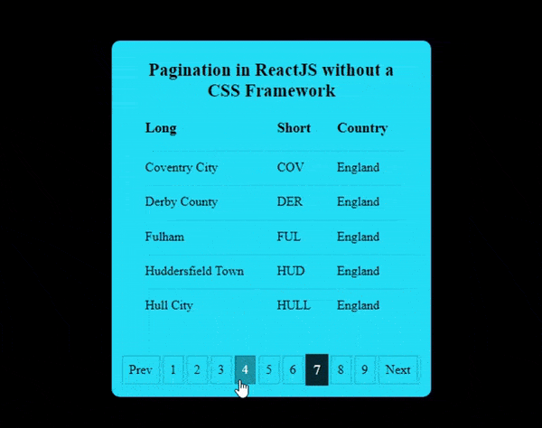

# Pagination in ReactJS without a CSS Framework

## What does this project do?

In this project, a pagination functionality was created. It was created without a CSS framework.

## What is Pagination?

Pagination is the sequence of numbers assigned to pages in a website. They help group a large amount of data or response into smaller groups. This grouping enables the user or viewer understand and navigate through the data in an orderly manner.

Pagination can be achieved using a CSS framework such as bootstrapCSS. However, nothing beats creating the logic yourself and knowing how it works under the hood. This gives you the advantage of customization and knowledge expansion. It enables you understand better how to use functions and props in ReactJS.

## How to start the project

This project was bootstrapped with [Create React App](https://github.com/facebook/create-react-app).

## Available Scripts

In the project directory, you can run:

### `npm start`

Runs the app in the development mode.\
Open [http://localhost:3000](http://localhost:3000) to view it in your browser.

The page will reload when you make changes.\
You may also see any lint errors in the console.

_author: Onuorah Bonaventure Chukwudi_

_twitter: [https://twitter.com/bonarhyme](https://twitter.com/bonarhyme)_

_blog: [https://blog.bonarhyme.com](https://blog.bonarhyme.com)_

_youtube: [Bonarhyme Tech Hub](https://www.youtube.com/channel/UCPT421nhI8h1nJ5vIIZ7M9A)_

_Patreon: [Bonarhyme Tech Hub](https://www.patreom.com/BonaryhmeTechHub)_

_Please leave a star_
